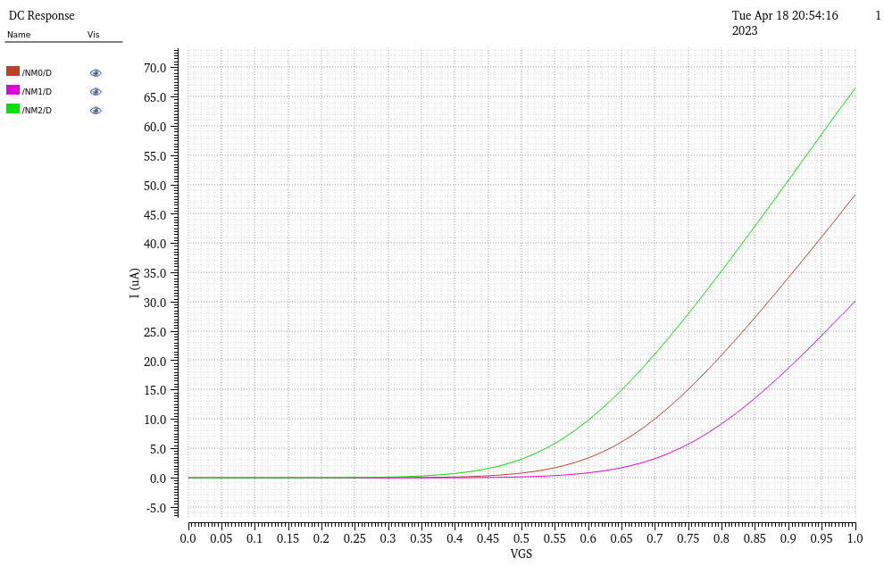
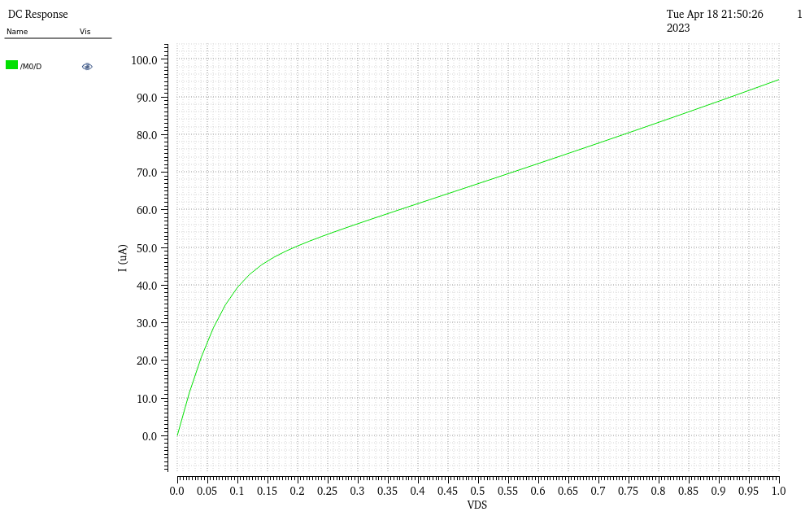

# EE 437 Final Project

### Alex, Eugene, Tyler, Micheal, Diego, Matthew

[GitHub Video Walkthrough](https://youtu.be/V73aTyj0jf8)

## Setup
### Creating a New SSH Key
1. SSH into the Linux server in the client of your choice, like PuTTY, MobaXTerm, or VSCode
1. Enter the following command to generate a new ssh key:
**Leave the file and passphrase blank**. If it prompts you to overwrite the file, enter `y`.
```bash
ssh-keygen -o -t rsa -b 4096 -C "YOUR_EMAIL_ADDRESS@EXAMPLE.COM"
```
1. Enter `cat ~/.ssh/id_rsa.pub` to output the new ssh key to the terminal.
1. Copy the text (`ctrl+C` works on your own computer, this is why using an SSH is easier than doing it on the Linux Servers).
1. Go to your personal settings on GitHub, under "SSH and GPG Keys" and click "New SSH Key".
1. Enter a descriptive name (like "Linux Lab Key") and paste the key into the GitHub box, and click "Add SSH Key".

### Cloning the GitHub Repository
1. In a Linux terminal, `cd` into the directory where you would like to have your `EE437` folder.
1. Enter `git clone git@github.com:Codax2000/ee437-wireline-transceiver.git EE437` into the command line. It should create a new directory
and populate it with the contents of the repository.
1. `cd` into the new folder and type `ls -al` to ensure that the contents roughly match the GitHub repository. 

### Testing Virtuoso
1. Enter `cd cadence` to enter the Cadence directory.
1. Enter `tcsh` to make sure you are using the c-shell, or this won't work.
1. Start Virtuoso by entering `virtuoso &`. The first time will take a few minutes, be patient.
1. In the library manager, you should see libraries for testing `GPDK` and `FreePDK`.

#### Testing `GPDK`
1. In the library manager, select `gpdk_test` and open the `nmos_test` schematic.
1. Launch ADE and load the `spectre_state1` simulation in ADE, under "Session > Load State", and select the `spectre_state1` _cellview_.
1. Run the simulation. It should show a VGS sweep, with high-vt, low-vt, and standard-vt devices, like this:


#### Testing `FreePDK`
1. If you have never used `FreePDK`, enter `vi ~/.cshrc` and add this line by pressing `i`.
```bash
source /home/lab.apps/vlsiapps/kits/FreePDK45/ncsu_basekit/cdssetup/setup.csh
```
Save your changes by pressing `esc` and entering `:wq` in vim.
1. In the library manager, select `freepdk_channel_response_test` and open the `test_nmos` schematic.
1. Launch ADE and load the `spectre_state1` simulation in ADE, under "Session > Load State", and select the `spectre_state1` _cellview_.
1. Run the simulation. It should show a typical VDS sweep with a set VGS, like this:

1. If there is an error showing that there is not associated model, go to Setup > Model Libraries and add `./cadence_refs/freepdk45.l`.

## Version Control
### Creating a New Branch
1. Go to the [GitHub Issues Page](https://github.com/Codax2000/ee437-wireline-transceiver/issues) and create a new issue. Describe what you will be doing.
1. On the right side, assign yourself under "Assignees".
1. Under "Development", create a new branch. The default name is fine, shorten if you like.
1. To switch to your new branch, enter:
```bash
git fetch origin
git checkout ENTER-NEW-BRANCH-NAME
```

### Collaborating With `git`
1. To save changes and add them to your branch on the main repository, enter the following:
```bash
git pull                        # pull any changes so you can push safely
git add .                       # track all files, or you can add them individually
git commit -m "COMMIT MESSAGE"  # briefly describe changes
git push                        # push your changes to GitHub
```
1. To merge your branch with the main, please create a pull request on GitHub.
    1. Go to [Pull Requests](https://github.com/Codax2000/ee437-wireline-transceiver/pulls).
    1. Create a new pull request, with `base: main` on the left and `compare: your-new-branch` on the right.
    1. Briefly describe what you've done in the branch you'd like to merge with main.
    1. Create the pull request.
1. It's good practice to ensure there aren't any conflicts before merging. GitHub will check these automatically.
1. **Please give others a heads up if your changes impact them.**
1. If there are no conflicts, confirm the merge and delete your old branch.
1. This should also resolve the issue in the issues page. Make sure it's been resolved by checking the issues page.

### Other Useful `git` Commands
1. To see all branches:
```bash
git branch --all
```
1. To delete a local branch (don't do this unless the corresponding GitHub branch is merged):
```bash
git branch -d branch-to-delete
```
